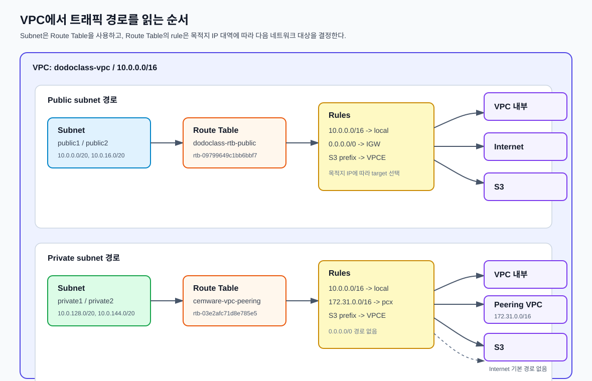
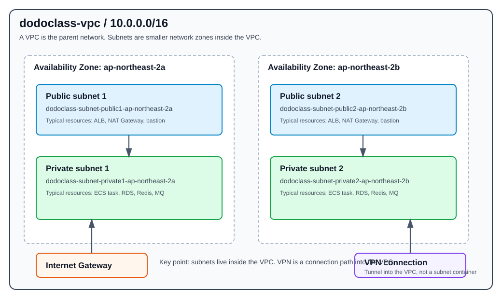
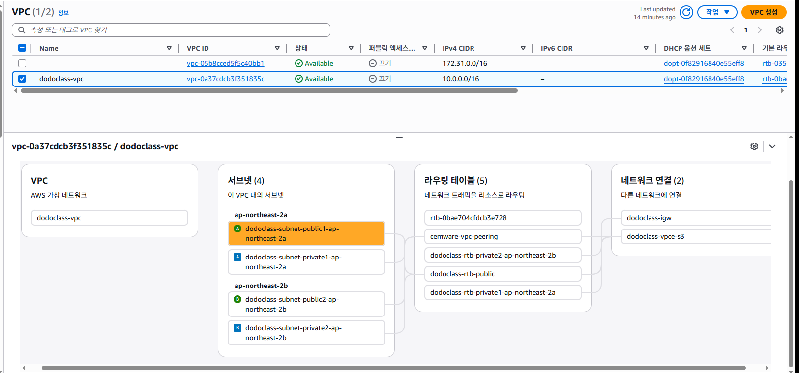
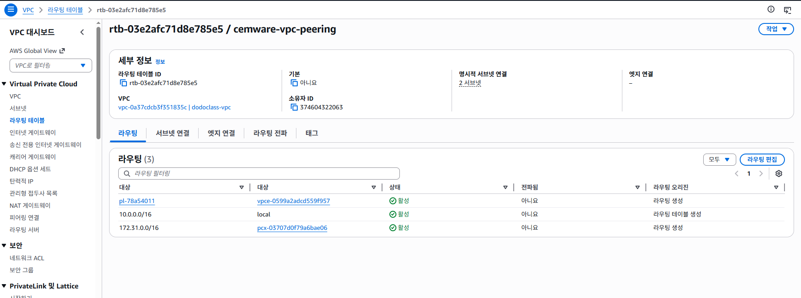

# 01. VPC와 네트워크

## 문서 목적

이 문서는 `dodoclass-vpc`의 네트워크 구성을 인수인계하기 위한 문서다.

목표는 VPC 메뉴 전체를 설명하는 것이 아니라, 운영자가 아래 질문에 답할 수 있도록 현재 네트워크 구조를 정리하는 것이다.

```text
인터넷에서 들어오는 경로가 있는가?
public subnet과 private subnet은 어떻게 나뉘어 있는가?
각 subnet의 트래픽은 어디로 라우팅되는가?
S3, 다른 VPC, 인터넷으로 가는 경로는 어떻게 구성되어 있는가?
private subnet의 리소스가 외부 인터넷으로 나갈 수 있는가?
```

## 라우팅 흐름 요약도

VPC 안의 리소스 트래픽은 아래 순서로 해석한다.

```text
VPC
-> Subnet
-> Route Table
-> Rule: 목적지 IP 대역 -> Target
-> 실제 네트워크 대상
```



## 핵심 결론

현재 `dodoclass-vpc`는 서울 리전(`ap-northeast-2`)의 2개 AZ에 public/private subnet을 나누어 구성되어 있다.

```text
dodoclass-vpc
CIDR: 10.0.0.0/16

ap-northeast-2a
├─ public1  10.0.0.0/20
└─ private1 10.0.128.0/20

ap-northeast-2b
├─ public2  10.0.16.0/20
└─ private2 10.0.144.0/20
```

네트워크 흐름은 다음과 같이 해석한다.

```text
public1 / public2
-> dodoclass-rtb-public
-> 0.0.0.0/0 -> Internet Gateway
=> 인터넷과 통신 가능한 public subnet

private1 / private2
-> cemware-vpc-peering
-> 10.0.0.0/16   -> local
-> 172.31.0.0/16 -> VPC Peering
-> S3 prefix     -> S3 VPC Endpoint
=> 일반 인터넷 outbound는 없고, VPC 내부 / Peering VPC / S3 Endpoint 경로만 있음
```

NAT Gateway는 존재하지 않는다. 따라서 private subnet의 리소스는 일반 인터넷으로 직접 outbound 통신할 수 없는 구조다. 단, S3는 Gateway VPC Endpoint를 통해 접근할 수 있고, `172.31.0.0/16` 대역은 VPC Peering을 통해 접근할 수 있다.

`172.31.0.0/16` 대역에는 별도 VPC `vpc-05b8cced5f5c40bb1`의 EC2 인스턴스 `nats-dodo-server`가 있는 것으로 확인되었다.

```text
nats-dodo-server
-> VPC: vpc-05b8cced5f5c40bb1
-> Private IP: 172.31.9.40
-> Public IP / Elastic IP: 54.116.54.86
```

따라서 `dodoclass-vpc`의 private subnet 리소스가 `172.31.9.40`으로 접근한다면, 그 트래픽은 VPC Peering 경로를 통해 이동하는 것으로 해석할 수 있다. 실제 접근 가능 여부는 양쪽 VPC의 route table과 security group을 함께 확인해야 한다.

## 기본 개념

### VPC

VPC는 AWS 안에 만든 사설 네트워크 공간이다.

쉽게 말하면 회사 내부망을 AWS에 만든 것이다. 이 안에 서버, 컨테이너, DB, 캐시 같은 리소스를 배치한다.

```text
VPC
= AWS 안에 만든 큰 사설 네트워크
```

### Subnet

Subnet은 VPC 안을 더 작은 네트워크 구역으로 나눈 것이다.

```text
Subnet
= VPC 안에 만든 작은 네트워크 구역
```

Subnet을 나누는 이유는 리소스를 역할별로 분리하기 위해서다.

```text
public subnet
= 인터넷과 가까운 구역
= ALB, NAT Gateway, Bastion 서버 등이 위치할 수 있음

private subnet
= 외부에서 직접 접근하면 안 되는 내부 구역
= ECS, RDS, ElastiCache, MQ 등이 위치할 수 있음
```

운영 관점에서는 subnet 이름만 보고 public/private 여부를 판단하면 안 된다. 실제 public subnet 여부는 route table로 판단한다.

public subnet으로 동작하려면 보통 route table에 아래 경로가 있다.

```text
0.0.0.0/0 -> Internet Gateway
```

private subnet은 외부에서 직접 들어오는 경로가 없어야 한다. 외부로 나가야 하는 경우에는 보통 NAT Gateway나 VPC Endpoint를 사용한다.

```text
Private Subnet
-> NAT Gateway
-> Internet

Private Subnet
-> S3 VPC Endpoint
-> S3
```

### AZ

AZ는 Availability Zone의 줄임말이고, 한국어로는 가용 영역이라고 한다.

AWS 리소스의 위치 관계는 아래처럼 이해하면 된다.

```text
Region
= AWS의 큰 지역

AZ
= Region 안에 있는 독립된 데이터센터 구역

Subnet
= 특정 AZ 안에 만들어지는 네트워크 구역
```

현재 구성은 서울 리전의 2개 AZ를 사용한다.

```text
ap-northeast-2
= 서울 리전

ap-northeast-2a
= 서울 리전 안의 AZ 하나

ap-northeast-2b
= 서울 리전 안의 다른 AZ
```

AZ를 나누는 이유는 장애를 분산하기 위해서다. 모든 리소스가 하나의 AZ에만 있으면 해당 AZ 장애가 서비스 전체 장애로 이어질 수 있다.

운영 관점에서는 실제 서비스 리소스가 두 AZ를 모두 사용하는지 확인해야 한다.

```text
ALB
-> public subnet 2개 AZ에 연결되어야 고가용성 구성이 가능함

ECS
-> private subnet 2개 AZ에 task를 배치할 수 있어야 함

RDS
-> Multi-AZ 구성이거나 subnet group이 2개 AZ를 포함해야 함
```

### VPC와 VPN에서 subnet의 위치

Subnet은 VPN 안에 들어가는 것이 아니라 VPC 안에 들어간다.

VPN은 외부 네트워크와 VPC를 연결하는 통로다. 예를 들어 회사 내부망에서 AWS 내부 리소스에 접근해야 할 때 Site-to-Site VPN을 붙일 수 있다.

```text
Company Network
-> VPN
-> VPC
-> Subnet
-> ECS / RDS / ElastiCache
```

정확한 표현은 다음과 같다.

```text
맞는 표현:
- subnet은 VPC 안에 있다.
- VPN은 외부 네트워크와 VPC를 연결한다.
- VPN으로 들어온 트래픽은 route table에 따라 특정 subnet의 리소스와 통신한다.

틀린 표현:
- subnet이 VPN 안에 있다.
```

## 구성도

### Subnet 배치



### VPC 리소스 맵



## VPC 기본 정보

현재 인수인계 대상 VPC는 `dodoclass-vpc`다.

```text
VPC 이름: dodoclass-vpc
VPC ID: vpc-0a37cdcb3f351835c
VPC CIDR: 10.0.0.0/16
상태: Available
VPC Block Public Access: 끄기
```

`VPC Block Public Access: 끄기`만 보고 "이 VPC가 인터넷에 공개되어 있다"거나 "인터넷과 완전히 단절되어 있다"고 판단하면 안 된다. 실제 공개 여부는 아래 항목을 함께 봐야 한다.

```text
Internet Gateway 연결 여부
Subnet의 route table
리소스의 public IP 여부
Security Group inbound 규칙
Load Balancer의 scheme
RDS public access 설정
```

## VPC 구성 상세

```text
VPC 이름: dodoclass-vpc
VPC CIDR: 10.0.0.0/16

AZ:
- ap-northeast-2a
- ap-northeast-2b

서브넷: 4개
- dodoclass-subnet-public1-ap-northeast-2a
- dodoclass-subnet-private1-ap-northeast-2a
- dodoclass-subnet-public2-ap-northeast-2b
- dodoclass-subnet-private2-ap-northeast-2b

주요 네트워크 연결:
- dodoclass-igw
- dodoclass-vpce-s3
- pcx-03707d0f79a6bae06
```

구성상 public/private subnet을 2개 AZ에 나눈 운영형 구조다. 네트워크 자체는 고가용성 구성을 위한 기본 틀을 갖고 있다. 실제 애플리케이션 고가용성 여부는 ALB, ECS, RDS, ElastiCache가 두 AZ를 모두 사용하는지 별도로 판단해야 한다.

## Subnet 상세 목록

| 구분 | Subnet 이름 | Subnet ID | AZ | IPv4 CIDR | 사용 가능 IPv4 | Route Table | Auto-assign public IPv4 | Network ACL | 비고 |
|---|---|---|---|---|---:|---|---|---|---|
| public1 | dodoclass-subnet-public1-ap-northeast-2a | subnet-07f24fa1d105ec101 | ap-northeast-2a | 10.0.0.0/20 | 4090 | rtb-09799649c1bb6bbf7 / dodoclass-rtb-public | 아니요 | acl-0da211814794f1662 | `0.0.0.0/0 -> Internet Gateway` 라우트가 있어 public subnet으로 동작 |
| private1 | dodoclass-subnet-private1-ap-northeast-2a | subnet-03d86ae13f982fa30 | ap-northeast-2a | 10.0.128.0/20 | 4090 | rtb-03e2afc71d8e785e5 / cemware-vpc-peering | 아니요 | acl-0da211814794f1662 | 인터넷 기본 경로 없음. VPC 내부, VPC Peering, S3 Endpoint 경로 사용 |
| public2 | dodoclass-subnet-public2-ap-northeast-2b | subnet-0ef0a980ff8eae441 | ap-northeast-2b | 10.0.16.0/20 | 4088 | rtb-09799649c1bb6bbf7 / dodoclass-rtb-public | 아니요 | acl-0da211814794f1662 | `0.0.0.0/0 -> Internet Gateway` 라우트가 있어 public subnet으로 동작 |
| private2 | dodoclass-subnet-private2-ap-northeast-2b | subnet-059a770b9ceaa77dc | ap-northeast-2b | 10.0.144.0/20 | 4090 | rtb-03e2afc71d8e785e5 / cemware-vpc-peering | 아니요 | acl-0da211814794f1662 | 인터넷 기본 경로 없음. VPC 내부, VPC Peering, S3 Endpoint 경로 사용 |

`Auto-assign public IPv4`가 `아니요`라는 것은 이 subnet에 EC2를 만들 때 public IP가 자동으로 붙지 않는다는 뜻이다. 이 값만으로 public/private subnet 여부를 판단하지 않는다. public/private 여부는 route table의 인터넷 경로로 판단한다.

## Route Table 읽는 법

Route Table은 subnet의 트래픽이 목적지별로 어디로 가야 하는지 결정하는 규칙표다.

AWS 콘솔의 라우팅 목록에서 첫 번째 `대상`과 두 번째 `대상`은 의미가 다르다.

```text
첫 번째 대상
= Destination
= 트래픽이 가려고 하는 목적지

두 번째 대상
= Target
= 그 목적지로 보내기 위해 사용할 다음 경로
```

두 번째 `대상`은 "적용할 규칙"이라기보다 "다음 홉" 또는 "전달 대상"이다. 라우팅 한 줄 전체가 규칙이다.

예시:

```text
172.31.0.0/16 -> pcx-03707d0f79a6bae06

의미:
목적지가 172.31.0.0/16이면
pcx-03707d0f79a6bae06 VPC Peering Connection으로 보내라.
```

`0.0.0.0/0`은 모든 IPv4 목적지를 의미한다. Route Table에서 `0.0.0.0/0 -> Internet Gateway`가 있으면, VPC 내부 목적지나 더 구체적인 경로에 걸리지 않는 트래픽을 Internet Gateway로 보낸다는 뜻이다.

## Prefix List

`pl-78a54011`은 AWS가 관리하는 prefix list다.

```text
Prefix List 이름: com.amazonaws.ap-northeast-2.s3
Prefix List ID: pl-78a54011
주소 패밀리: IPv4
상태: Create-complete
소유자: AWS
```

Prefix List는 특정 서비스가 사용하는 IP 대역 묶음이다. 여기서는 서울 리전 S3가 사용하는 IPv4 CIDR 목록을 AWS가 관리한다.

확인된 항목 예시:

```text
3.5.140.0/22
3.5.144.0/23
3.5.184.0/21
52.219.144.0/22
52.219.148.0/23
52.219.202.0/23
52.219.204.0/22
52.219.56.0/22
52.219.60.0/23
```

S3는 하나의 IP만 쓰는 서비스가 아니라 여러 IP 대역을 사용하는 분산 서비스다. 사용자가 이 CIDR을 직접 관리하지 않도록 AWS가 prefix list로 묶어 제공한다.

Route Table의 아래 경로는 서울 리전 S3 주소 대역으로 가는 트래픽을 S3 Gateway Endpoint로 보내라는 의미다.

```text
pl-78a54011 -> vpce-0599a2adcd559f957
```

## S3 VPC Endpoint

`dodoclass-vpce-s3`는 서울 리전 S3로 가기 위한 VPC Endpoint 리소스다.

```text
Endpoint 이름: dodoclass-vpce-s3
Endpoint ID: vpce-0599a2adcd559f957
Endpoint 유형: Gateway
Service name: com.amazonaws.ap-northeast-2.s3
Service Region: ap-northeast-2
VPC: dodoclass-vpc
상태: 사용 가능
IP 주소 유형: IPv4
```

Gateway Endpoint는 subnet 안에 ENI를 만드는 방식이 아니다. Route Table에 prefix list 경로를 추가하는 방식이다.

```text
VPC Endpoint 리소스:
dodoclass-vpce-s3

Route Table에 추가되는 경로:
pl-78a54011 -> vpce-0599a2adcd559f957
```

연결된 route table:

```text
cemware-vpc-peering
dodoclass-rtb-private2-ap-northeast-2b
dodoclass-rtb-public
dodoclass-rtb-private1-ap-northeast-2a
```

S3가 VPC 내부로 들어오는 것은 아니다. VPC 안의 리소스가 S3에 접근할 때 인터넷/NAT를 거치지 않고 Gateway Endpoint 경로를 사용할 수 있다는 의미다.

## Route Table 상세

### dodoclass-rtb-public

기본 정보:

```text
Route Table 이름: dodoclass-rtb-public
Route Table ID: rtb-09799649c1bb6bbf7
VPC: dodoclass-vpc
기본 라우팅 테이블: 아니요
명시적 subnet 연결: 2개 subnet
엣지 연결: 없음
```

연결된 subnet:

```text
dodoclass-subnet-public1-ap-northeast-2a
dodoclass-subnet-public2-ap-northeast-2b
```

라우팅:

| Destination | Target | 상태 | 의미 |
|---|---|---|---|
| 10.0.0.0/16 | local | 활성 | VPC 내부 통신 경로 |
| 0.0.0.0/0 | igw-014e67a29b6db2e72 | 활성 | 인터넷으로 나가는 기본 경로. 이 route table에 연결된 subnet은 public subnet으로 동작 |
| pl-78a54011 | vpce-0599a2adcd559f957 | 활성 | 서울 리전 S3로 가는 트래픽을 S3 Gateway Endpoint로 전달 |

운영 해석:

```text
public1/public2 subnet은 실제 public subnet이다.
근거는 `0.0.0.0/0 -> Internet Gateway` 라우트가 있기 때문이다.

단, 이 subnet에 있는 리소스가 모두 외부 공개되는 것은 아니다.
외부 접근 가능 여부는 리소스의 public IP, Security Group, NACL, 서비스 설정까지 함께 봐야 한다.
```

### cemware-vpc-peering

기본 정보:

```text
Route Table 이름: cemware-vpc-peering
Route Table ID: rtb-03e2afc71d8e785e5
VPC: dodoclass-vpc
기본 라우팅 테이블: 아니요
명시적 subnet 연결: 2개 subnet
엣지 연결: 없음
```

연결된 subnet:

```text
dodoclass-subnet-private1-ap-northeast-2a
dodoclass-subnet-private2-ap-northeast-2b
```

라우팅:



| Destination | Target | 상태 | 의미 |
|---|---|---|---|
| 10.0.0.0/16 | local | 활성 | VPC 내부 통신 경로 |
| 172.31.0.0/16 | pcx-03707d0f79a6bae06 | 활성 | 다른 VPC로 가는 VPC Peering 경로 |
| pl-78a54011 | vpce-0599a2adcd559f957 | 활성 | 서울 리전 S3로 가는 트래픽을 S3 Gateway Endpoint로 전달 |

라우팅 해석:

```text
private subnet
-> cemware-vpc-peering route table
   ├─ 10.0.0.0/16   -> local
   ├─ 172.31.0.0/16 -> VPC Peering(pcx)
   └─ S3 prefix     -> VPC Endpoint(vpce)
```

`pcx`와 `vpce`는 서로 연결된 것이 아니다. 같은 route table 안에 목적지별로 서로 다른 경로가 들어 있는 것이다.

```text
목적지가 10.0.0.0/16이면
-> 같은 VPC 내부로 보낸다.

목적지가 172.31.0.0/16이면
-> VPC Peering Connection으로 보낸다.

목적지가 S3 prefix list이면
-> VPC Endpoint로 보낸다.
```

운영 해석:

```text
private1/private2 subnet은 인터넷 기본 경로가 없다.
근거는 `0.0.0.0/0 -> NAT Gateway` 또는 `0.0.0.0/0 -> Internet Gateway` 라우트가 없기 때문이다.

이 subnet에서 가능한 주요 통신 경로는 현재 기준으로 다음과 같다.
- 10.0.0.0/16: 같은 VPC 내부 통신
- 172.31.0.0/16: VPC Peering으로 연결된 다른 VPC 통신
- pl-78a54011: S3 Gateway Endpoint를 통한 S3 접근

따라서 private subnet의 ECS/EC2가 일반 인터넷으로 직접 outbound 통신해야 한다면,
현재 라우팅만으로는 불가능하다.
```

### dodoclass-rtb-private1-ap-northeast-2a

기본 정보:

```text
Route Table 이름: dodoclass-rtb-private1-ap-northeast-2a
Route Table ID: rtb-02cc1a2c6ad0c680a
VPC: dodoclass-vpc
기본 라우팅 테이블: 아니요
명시적 subnet 연결: 없음
엣지 연결: 없음
```

라우팅:

| Destination | Target | 상태 | 의미 |
|---|---|---|---|
| 10.0.0.0/16 | local | 활성 | VPC 내부 통신 경로 |
| pl-78a54011 | vpce-0599a2adcd559f957 | 활성 | 서울 리전 S3로 가는 트래픽을 S3 Gateway Endpoint로 전달 |

운영 해석:

```text
현재 이 route table은 명시적으로 연결된 subnet이 없다.
따라서 현재 EC2/ECS/RDS 등 subnet 기반 리소스의 트래픽 경로에는 직접 적용되지 않는다.

다만 S3 VPC Endpoint에 연결되어 있으므로,
과거 private subnet용 route table이었거나 예비 구성으로 남아 있는 route table로 해석할 수 있다.
삭제나 변경 전에는 IaC, 태그, 생성 이력을 확인해야 한다.
```

### dodoclass-rtb-private2-ap-northeast-2b

기본 정보:

```text
Route Table 이름: dodoclass-rtb-private2-ap-northeast-2b
Route Table ID: rtb-0e03c3473647efa63
VPC: dodoclass-vpc
기본 라우팅 테이블: 아니요
명시적 subnet 연결: 없음
엣지 연결: 없음
```

라우팅:

| Destination | Target | 상태 | 의미 |
|---|---|---|---|
| 10.0.0.0/16 | local | 활성 | VPC 내부 통신 경로 |
| pl-78a54011 | vpce-0599a2adcd559f957 | 활성 | 서울 리전 S3로 가는 트래픽을 S3 Gateway Endpoint로 전달 |

운영 해석:

```text
현재 이 route table도 명시적으로 연결된 subnet이 없다.
따라서 현재 EC2/ECS/RDS 등 subnet 기반 리소스의 트래픽 경로에는 직접 적용되지 않는다.

`dodoclass-rtb-private1-ap-northeast-2a`와 같은 형태이므로,
과거 AZ별 private route table 구성이 남아 있거나 예비 구성으로 남아 있는 route table로 해석할 수 있다.
삭제나 변경 전에는 IaC, 태그, 생성 이력을 확인해야 한다.
```

### 기타 Route Table

VPC 구성도에는 `rtb-0bae704cfdcb3e728`도 표시되어 있다. 현재 인수인계 범위에서 실제 subnet 연결과 라우팅 상세가 문서화된 주요 route table은 아래 4개다.

```text
dodoclass-rtb-public
cemware-vpc-peering
dodoclass-rtb-private1-ap-northeast-2a
dodoclass-rtb-private2-ap-northeast-2b
```

`rtb-0bae704cfdcb3e728`은 현재 서비스 트래픽 경로로 해석된 public/private subnet 연결에는 포함되어 있지 않다.

## Internet Gateway

`dodoclass-igw`는 `dodoclass-vpc`에 연결된 Internet Gateway다.

```text
Internet Gateway: dodoclass-igw
연결 VPC: dodoclass-vpc
```

운영 해석:

```text
dodoclass-vpc는 Internet Gateway를 가지고 있다.
public subnet이 사용하는 `dodoclass-rtb-public`에는 `0.0.0.0/0 -> Internet Gateway` 라우트가 있다.
따라서 public1/public2 subnet은 인터넷과 통신 가능한 public subnet으로 동작한다.
```

Internet Gateway가 있다고 해서 VPC 안의 모든 리소스가 인터넷에 공개되는 것은 아니다. 실제 외부 접근은 public IP, Security Group, NACL, 서비스 설정에 의해 결정된다.

## NAT Gateway

현재 VPC에서 NAT Gateway는 존재하지 않는다.

운영 해석:

```text
private1/private2 subnet의 route table에는 `0.0.0.0/0 -> NAT Gateway` 라우트가 없다.
VPC에도 NAT Gateway가 존재하지 않는다.

따라서 private subnet의 리소스는 일반 인터넷으로 직접 outbound 통신할 수 없는 구조다.
다만 S3는 `dodoclass-vpce-s3` Gateway Endpoint를 통해 접근할 수 있다.
172.31.0.0/16 대역은 VPC Peering을 통해 접근할 수 있다.
```

## VPC Peering

### VPC Peering이란

VPC Peering은 서로 다른 두 VPC를 연결해서 private IP 대역으로 통신하게 해주는 연결이다.

```text
VPC A
<-> VPC Peering
<-> VPC B
```

VPC Peering을 사용하면 인터넷을 거치지 않고 VPC 간 통신을 할 수 있다. 이때 통신은 public IP가 아니라 각 VPC의 private CIDR 대역을 기준으로 이루어진다.

VPC Peering은 연결만 있다고 바로 통신이 보장되는 것은 아니다. 양쪽 VPC의 route table과 보안 규칙이 모두 맞아야 한다.

```text
dodoclass-vpc 쪽 route:
172.31.0.0/16 -> pcx-03707d0f79a6bae06

상대 VPC 쪽 반환 route:
10.0.0.0/16 -> pcx-03707d0f79a6bae06
```

Security Group, Network ACL, OS 방화벽도 필요한 포트를 허용해야 실제 통신이 된다.

### Peering 연결 정보

`pcx-03707d0f79a6bae06`은 `dodoclass-vpc`와 다른 VPC를 연결하는 VPC Peering Connection이다.

```text
Peering Connection ID: pcx-03707d0f79a6bae06
상태: Active

Requester Owner ID: 909164781791
Requester VPC: vpc-e166ac8a
Requester CIDR: 172.31.0.0/16
Requester Region: ap-northeast-2

Accepter Owner ID: 374604322063
Accepter VPC: vpc-0a37cdcb3f351835c / dodoclass-vpc
Accepter CIDR: 10.0.0.0/16
Accepter Region: ap-northeast-2

DNS 설정:
Requester VPC에서 Accepter VPC의 host name을 private IP로 확인하도록 허용: 비활성화
```

운영 해석:

```text
private1/private2 subnet은 cemware-vpc-peering route table을 사용한다.
해당 route table에는 `172.31.0.0/16 -> pcx-03707d0f79a6bae06` 라우트가 있다.

따라서 private subnet의 리소스는 172.31.0.0/16 대역의 requester VPC와 통신할 수 있는 경로를 가진다.
```

`172.31.0.0/16`은 AWS 기본 VPC에서 자주 사용되는 CIDR 대역이다. 따라서 requester VPC가 기본 VPC일 가능성은 있지만, 이것만으로 실제 용도를 확정할 수는 없다. 이 VPC가 어떤 시스템인지, 어떤 서비스와 통신하는지는 상대 계정 또는 관련 애플리케이션 설정에서 확인해야 한다.

## 현재 네트워크 흐름 해석

### Public Subnet 경로

```text
public1/public2
-> dodoclass-rtb-public
   ├─ 10.0.0.0/16 -> local
   ├─ 0.0.0.0/0  -> Internet Gateway
   └─ S3 prefix   -> S3 Gateway Endpoint
```

public subnet은 인터넷과 통신할 수 있는 경로를 가진다. 다만 subnet 자체가 public이라고 해서 그 안의 모든 리소스가 외부에 노출되는 것은 아니다.

### Private Subnet 경로

```text
private1/private2
-> cemware-vpc-peering
   ├─ 10.0.0.0/16   -> local
   ├─ 172.31.0.0/16 -> VPC Peering
   └─ S3 prefix     -> S3 Gateway Endpoint
```

private subnet은 일반 인터넷 기본 경로가 없다.

```text
없는 경로:
0.0.0.0/0 -> NAT Gateway
0.0.0.0/0 -> Internet Gateway
```

따라서 private subnet의 리소스는 일반 인터넷으로 직접 나갈 수 없다. S3 접근은 VPC Endpoint로 가능하고, `172.31.0.0/16` 대역 접근은 VPC Peering으로 가능하다.

## 서비스 흐름 가설

현재 VPC 구성과 비용 항목을 기준으로 보면, 서비스 흐름은 아래 구조일 가능성이 높다.

```text
User
-> Internet
-> Internet Gateway
-> Public Subnet
-> Load Balancer
-> Private Subnet
-> ECS
-> RDS / ElastiCache / MQ
```

이 흐름은 VPC 네트워크 기준의 해석이다. 실제 애플리케이션 연결 관계는 Load Balancer, ECS, RDS, ElastiCache, MQ, Security Group을 함께 봐야 확정된다.

## 운영 포인트

- public/private 이름만 보고 공개 여부를 판단하면 안 된다.
- public subnet 여부는 route table의 `0.0.0.0/0 -> Internet Gateway` 경로로 판단한다.
- private subnet은 현재 일반 인터넷 outbound 경로가 없다.
- S3 접근은 `dodoclass-vpce-s3` Gateway Endpoint를 통해 가능하다.
- `pcx-03707d0f79a6bae06` Peering으로 `172.31.0.0/16` VPC와 통신할 수 있는 경로가 있다.
- Peering 통신은 양쪽 route table과 Security Group/NACL이 모두 허용해야 실제로 동작한다.
- subnet에 연결되지 않은 route table은 현재 subnet 기반 리소스 트래픽에는 직접 적용되지 않는다.
- Security Group은 이름이 아니라 실제 inbound/outbound 규칙을 봐야 한다.
- DB, Redis, MQ가 `0.0.0.0/0`에 열려 있으면 위험 신호다.
