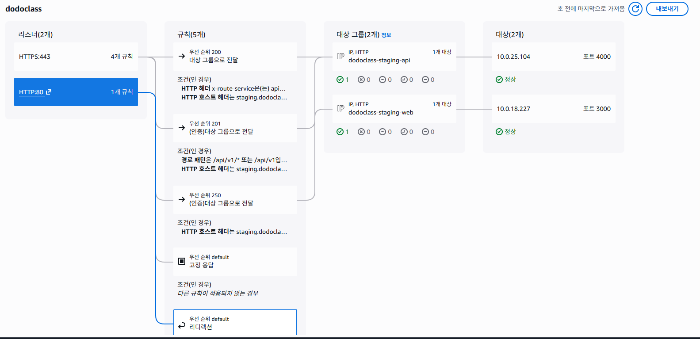

# 02. 외부 진입점: DNS, Load Balancer

## 판단 질문

사용자 요청은 AWS의 어느 지점으로 들어오고, 그 요청은 어디로 전달되는가?

## 기본 개념

외부 진입점은 사용자의 요청이 처음 도착하는 곳이다.

현재 확인된 흐름은 다음과 같다.

```text
User
-> 외부 DNS provider
-> staging.dodoclass.co.kr
-> ALB dodoclass
-> Listener
-> Listener Rule
-> Target Group
-> ECS Fargate Service
-> 등록된 IP target
```

Route 53에는 Hosted Zone이 없는 것으로 확인되었다. 따라서 `dodoclass.co.kr` 도메인의 DNS는 AWS Route 53이 아니라 외부 DNS provider에서 관리되는 것으로 추정된다.

다만 실제 DNS 레코드가 ALB DNS 이름을 직접 가리키는지, CloudFront 같은 다른 앞단을 거쳐 오는지는 외부 DNS 설정 또는 `nslookup`으로 확인해야 한다.

## 현재 확인된 진입점



### Load Balancer

```text
Load Balancer 이름: dodoclass
유형: Application Load Balancer
Scheme: Internet-facing
IP 주소 유형: IPv4
VPC: vpc-0a37cdcb3f351835c
DNS name: dodoclass-1695626203.ap-northeast-2.elb.amazonaws.com
Security Group: sg-0a4e7b2531fe32090
가용 영역:
- ap-northeast-2a: subnet-07f24fa1d105ec101
- ap-northeast-2b: subnet-0ef0a980ff8eae441
```

이 ALB는 `Internet-facing`이므로 외부 인터넷에서 접근 가능한 진입점이다. 실제 공개 범위는 ALB의 Security Group inbound rule과 Listener 설정까지 함께 확인해야 한다.

### Listener

```text
HTTP:80
-> HTTPS:443으로 redirect
-> 상태 코드: HTTP_301

HTTPS:443
-> 인증서: *.dodoclass.co.kr
-> 기본 작업: Fixed response 404 Not Found
-> Listener Rule 조건에 맞을 때만 Target Group으로 전달
```

`HTTP:80` 요청을 `HTTPS:443`으로 redirect하는 것은 일반적인 HTTPS 강제 패턴이다.

`HTTPS:443`의 기본 작업이 404인 것은 조건에 맞지 않는 요청을 애플리케이션으로 보내지 않는다는 의미다. 운영 관점에서는 안전한 기본값에 가깝지만, 실제 서비스 경로는 Listener Rule을 통해 확인해야 한다.

### HTTPS Listener Rule

현재 캡처 기준으로 확인된 규칙은 다음과 같다.

우선순위 숫자는 HTTP 상태 코드가 아니라 ALB Listener Rule의 평가 순서다. 숫자가 낮은 규칙부터 먼저 검사되고, 조건에 맞는 첫 번째 규칙의 작업이 실행된다.

```text
우선순위 200
조건:
- Host header = staging.dodoclass.co.kr
- HTTP header x-route-service = api
작업:
- Target Group dodoclass-staging-api 로 전달

우선순위 201
조건:
- Host header = staging.dodoclass.co.kr
- Path = /api/v1/* 또는 /api/v1
작업:
- OIDC 인증 사용
- 인증 후 Target Group dodoclass-staging-api 로 전달

우선순위 250
조건:
- Host header = staging.dodoclass.co.kr
작업:
- OIDC 인증 사용
- 인증 후 Target Group dodoclass-staging-web 로 전달

마지막 기본 규칙
조건:
- 다른 규칙이 적용되지 않는 경우
작업:
- Fixed response 404 Not Found 반환
```

현재 HTTPS Listener의 OIDC 설정은 다음과 같다.

```text
Issuer: https://sso.cemware.com
Token endpoint: https://sso.cemware.com/oauth2/token
User info endpoint: https://sso.cemware.com/oidc/userinfo
Authorization endpoint: https://sso.cemware.com/oauth2/authorize
Session cookie name: AWSELBAuthSessionCookie
Unauthenticated request 처리: authenticate
Scope: openid
```

주의할 점은 우선순위 200 규칙이다. `x-route-service=api` 헤더가 있으면 OIDC 인증 없이 `dodoclass-staging-api`로 전달되는 것처럼 보인다. API 서버 자체에서 인증을 검증한다면 문제가 아닐 수 있지만, 그렇지 않다면 인증 우회 경로가 될 수 있다.

이 부분은 단정하지 말고, 애플리케이션 코드 또는 API 인증 설정에서 별도로 확인해야 한다.

정리하면 현재 `staging.dodoclass.co.kr` 요청은 크게 두 갈래로 나뉜다.

```text
API 요청
Host: staging.dodoclass.co.kr
Path: /api/v1 또는 /api/v1/*
-> OIDC 인증
-> dodoclass-staging-api:4000
-> ECS Service dodoclass-staging-api

Web 요청
Host: staging.dodoclass.co.kr
-> OIDC 인증
-> dodoclass-staging-web:3000
-> ECS Service dodoclass-staging-web
```

단, `x-route-service=api` 헤더가 있는 요청은 별도 규칙으로 먼저 처리되므로, 이 헤더를 누가 어떤 목적으로 붙이는지 확인해야 한다.

## Target Group

### dodoclass-staging-api

```text
Target Group 이름: dodoclass-staging-api
대상 유형: IP
프로토콜: HTTP
포트: 4000
프로토콜 버전: HTTP1
VPC: vpc-0a37cdcb3f351835c
Load Balancer: dodoclass
등록된 대상:
- 10.0.25.104:4000 Healthy
```

### dodoclass-staging-web

```text
Target Group 이름: dodoclass-staging-web
대상 유형: IP
프로토콜: HTTP
포트: 3000
프로토콜 버전: HTTP1
VPC: vpc-0a37cdcb3f351835c
Load Balancer: dodoclass
등록된 대상:
- 10.0.18.227:3000 Healthy
```

두 Target Group 모두 대상 유형이 `IP`이며, ECS 클러스터 `dodoclass-staging`의 Fargate 서비스와 연결되는 것으로 확인되었다.

```text
Target Group dodoclass-staging-api
-> ECS Cluster dodoclass-staging
-> ECS Service dodoclass-staging-api
-> Fargate task 1/1 running
-> Service subnet:
   - subnet-0ef0a980ff8eae441
   - subnet-07f24fa1d105ec101
-> Task Security Group: sg-0feb0171e115e8c56
-> Public IP 자동 지정: 켜짐

Target Group dodoclass-staging-web
-> ECS Cluster dodoclass-staging
-> ECS Service dodoclass-staging-web
-> Fargate task 1/1 running
-> Service subnet:
   - subnet-059a770b9ceaa77dc
   - subnet-0ef0a980ff8eae441
   - subnet-03d86ae13f982fa30
   - subnet-07f24fa1d105ec101
-> Task Security Group: sg-0feb0171e115e8c56
-> Public IP 자동 지정: 켜짐
```

## 확인할 화면

```text
Route 53 > Hosted zones
CloudFront > Distributions
API Gateway > APIs
EC2 > Load Balancers
EC2 > Target Groups
```

## 확인할 것

- 외부 DNS provider에서 `staging.dodoclass.co.kr`이 어디를 가리키는지 확인한다.
- `staging.dodoclass.co.kr`이 ALB DNS name으로 연결되는지 확인한다.
- CloudFront나 API Gateway가 ALB 앞단에 있는지 확인한다.
- ALB Security Group inbound rule이 `80`, `443`만 허용하는지 확인한다.
- `x-route-service=api` 헤더 기반 규칙이 왜 필요한지 확인한다.
- ECS Service의 task subnet과 task security group을 확인한다.
- Health check path와 success code를 확인한다.

## 운영 포인트

- Load Balancer는 외부 장애를 가장 먼저 확인할 수 있는 지점이다.
- Target Group Health가 unhealthy이면 애플리케이션이 떠 있어도 사용자는 접근하지 못할 수 있다.
- HTTPS 인증서는 보통 `ACM`에서 관리된다.
- Listener Rule을 수정하면 특정 경로의 요청이 엉뚱한 서비스로 갈 수 있다.
- `Internet-facing` ALB는 인터넷에서 접근 가능한 리소스이므로 Security Group과 인증 설정을 같이 봐야 한다.
- Target Group이 `Healthy`여도 애플리케이션의 로그인, API 권한, DB 연결이 정상이라는 뜻은 아니다.
- Header 조건 기반 라우팅은 외부 사용자가 같은 헤더를 직접 보낼 수 있으므로 인증 우회 가능성을 확인해야 한다.
- ECS Service가 `1/1 running`이어도 애플리케이션 로그나 의존 서비스 연결까지 정상이라는 뜻은 아니다.
- ECS Fargate 서비스의 Public IP 자동 지정이 켜져 있다. Task Security Group inbound가 넓게 열려 있으면 ALB와 OIDC를 거치지 않고 task에 직접 접근될 가능성이 있으므로 반드시 확인해야 한다.

## 기록 형식

```text
Load Balancer 이름: dodoclass
DNS name: dodoclass-1695626203.ap-northeast-2.elb.amazonaws.com
Scheme: internet-facing
Listener:
- HTTP:80 -> HTTPS:443 redirect
- HTTPS:443 -> Listener Rule 기반 라우팅
Target Group:
- dodoclass-staging-api: HTTP 4000, IP target, Healthy
- dodoclass-staging-web: HTTP 3000, IP target, Healthy
연결된 Security Group: sg-0a4e7b2531fe32090
```

## 아직 모르는 것

- 외부 DNS provider의 실제 레코드 설정
- `staging.dodoclass.co.kr`이 ALB를 직접 가리키는지 여부
- CloudFront나 API Gateway가 앞단에 있는지 여부
- ALB Security Group inbound rule 상세
- ECS task Security Group `sg-0feb0171e115e8c56`의 inbound rule 상세
- `x-route-service=api` 규칙의 의도와 API 자체 인증 여부
