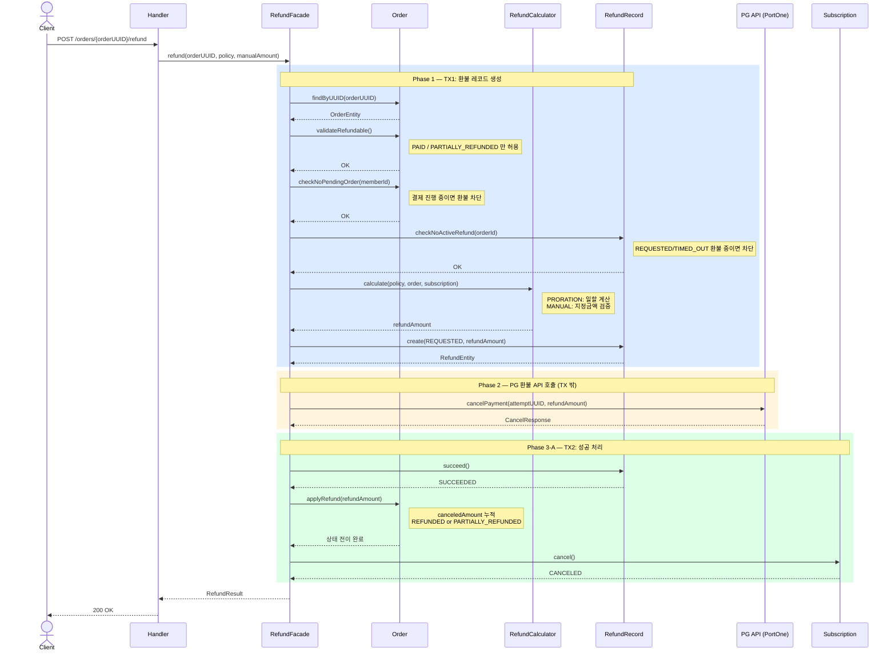
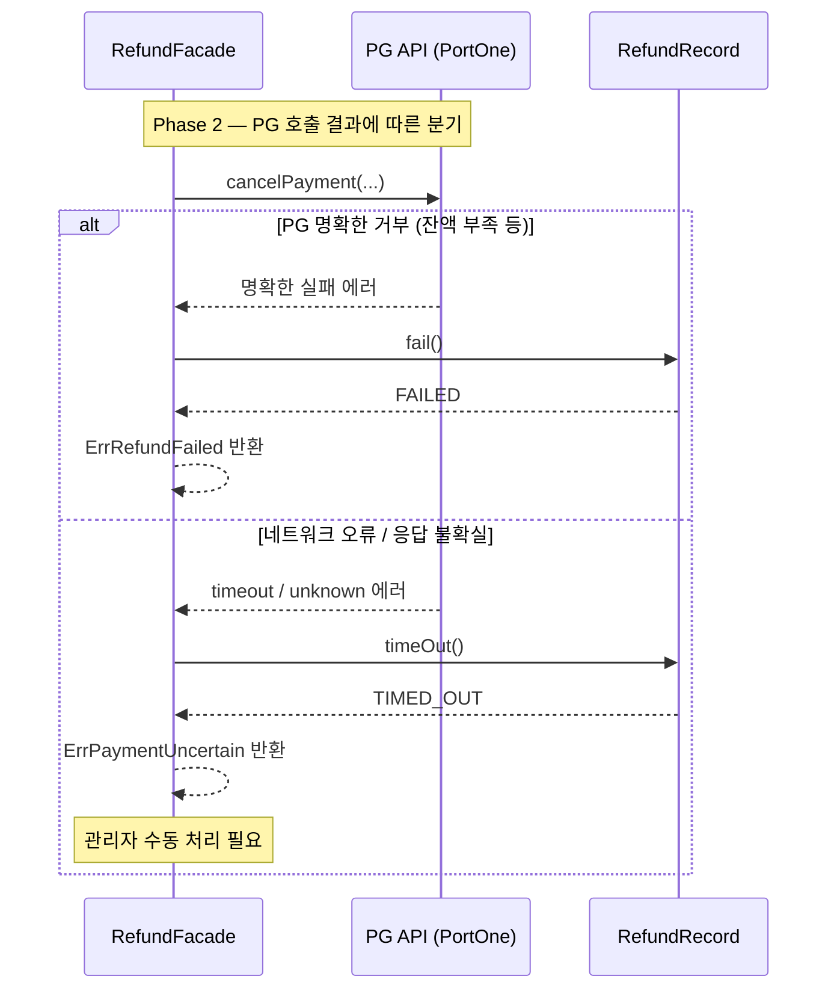
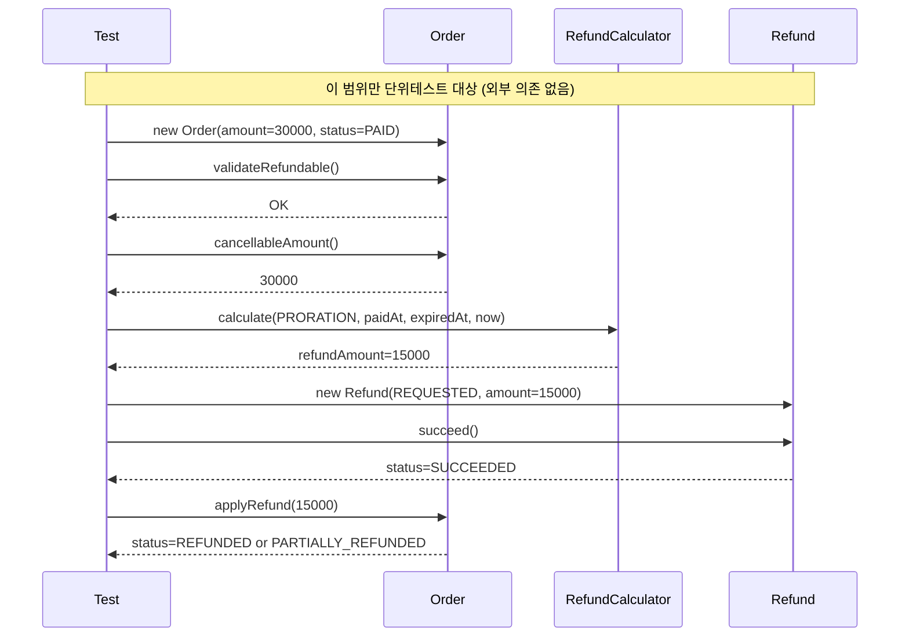

# 환불 정책 도메인 설계

> 실업무 기반: DoDo Class 구독 결제 서비스의 환불 로직을 Java 도메인으로 재설계한다.
> 이 문서는 코드 작성 전 설계 기준이며, A-3 단위테스트와 A-4 Gherkin의 근거가 된다.

---

## 1. 도메인 개념

### 핵심 개념

| 개념 | 설명 |
|------|------|
| Order (주문) | 결제가 완료된 구독 주문. 환불의 대상이 된다. |
| Refund (환불) | 주문에 대한 환불 요청 및 그 결과. |
| RefundPolicy (환불 정책) | 환불 금액을 어떻게 산출할지 결정하는 규칙. |
| CancellableAmount (환불 가능 금액) | `주문금액 - 이미 환불된 금액`. 이 금액을 초과해서 환불할 수 없다. |

### 이번 scope

- 환불 금액 산출 (일할 계산, 수동 지정)
- 환불 후 주문 상태 전이
- 환불 엔티티 상태 전이
- PG 연동, DB, 구독 취소는 scope 밖 (외부 의존 → Mock 대상)

---

## 2. 순서 다이어그램

### 2-1. 전체 흐름 (Happy Path)



### 2-2. 실패 분기



### 2-3. task1 scope (순수 도메인만)



---

## 3. 상태 다이어그램

### 2-1. 주문(Order) 상태

```
[PAID] ──────────────────────────────▶ [REFUNDED]
  │          (환불금액 >= 전체금액)
  │
  └──────────────────────────────────▶ [PARTIALLY_REFUNDED]
               (환불금액 < 전체금액)
                    │
                    └────────────────▶ [REFUNDED]
                         (추가 환불로 전액 도달)
```

- 환불 가능한 초기 상태: `PAID`, `PARTIALLY_REFUNDED`
- `REFUNDED` 상태에서는 추가 환불 불가
- `PENDING`, `FAILED` 상태에서는 환불 불가

### 2-2. 환불(Refund) 상태

```
              [REQUESTED]
             /     |     \
            /      |      \
     [SUCCEEDED] [FAILED] [TIMED_OUT]
```

- `REQUESTED`: 환불 요청이 생성된 상태. PG 호출 전.
- `SUCCEEDED`: PG 환불 성공.
- `FAILED`: PG가 환불을 명확히 거부 (잔액 부족 등).
- `TIMED_OUT`: 네트워크 오류 등 결과 불확실. 관리자 수동 처리 필요.

---

## 3. 환불 정책 (RefundPolicy)

### 3-1. PRORATION (일할 계산)

구독 기간 중 사용하지 않은 일수에 비례하여 환불한다.

```
일할 단가  = 결제금액 / 총 구독 일수
환불금액   = 일할 단가 × 잔여 일수

단, 잔여 일수 == 총 일수 (당일 환불) → 전액 환불
단, 잔여 일수 == 0 → 환불금액 0원
```

**예시**

| 결제금액 | 총 일수 | 잔여 일수 | 일할 단가 | 환불금액 |
|---------|--------|---------|---------|--------|
| 30,000원 | 30일 | 15일 | 1,000원 | 15,000원 |
| 30,000원 | 30일 | 30일 | 1,000원 | 30,000원 (전액) |
| 30,000원 | 30일 | 0일  | 1,000원 | 0원 |
| 10,000원 | 30일 | 7일  | 333원   | 2,331원 (절사) |

> 소수점 이하는 절사(floor). 단가 = price / totalDays (정수 나눗셈).

### 3-2. MANUAL (수동 지정)

관리자가 환불 금액을 직접 지정한다.

```
환불금액 = 지정금액
단, 지정금액 > 환불 가능 금액 → 오류
단, 지정금액 <= 0 → 오류
```

---

## 4. 환불 유형 결정

환불 금액이 확정된 후 환불 유형을 결정한다.

```
환불금액 >= 환불 가능 금액 → FULL
환불금액 <  환불 가능 금액 → PARTIAL
```

---

## 5. 경계값 및 예외 케이스

### 5-1. 일할 계산 경계값

| 케이스 | 입력 | 기대 결과 |
|--------|------|----------|
| 당일 환불 | remainingDays == totalDays | 전액 환불 |
| 마지막 날 환불 | remainingDays == 1 | 일할 단가 × 1 |
| 만료 후 환불 | remainingDays == 0 | 환불금액 0 |
| 소수점 절사 | 10,000원 / 30일 × 7일 | 2,331원 |
| totalDays <= 0 | 잘못된 구독 기간 | 예외 발생 |

### 5-2. 환불 가능 여부 경계값

| 케이스 | 조건 | 기대 결과 |
|--------|------|----------|
| 정상 환불 | 주문 PAID, 환불금액 <= cancellableAmount | 성공 |
| 이미 전액 환불 | 주문 REFUNDED | 환불 불가 예외 |
| 결제 안 된 주문 | 주문 PENDING / FAILED | 환불 불가 예외 |
| 환불금액 초과 | 환불금액 > cancellableAmount | 예외 발생 |
| 수동 금액 0 이하 | manualAmount <= 0 | 예외 발생 |
| 부분 환불 후 전액 도달 | canceledAmount + refundAmount == amount | REFUNDED 전이 |
| 부분 환불 후 미도달 | canceledAmount + refundAmount < amount | PARTIALLY_REFUNDED 유지 |

### 5-3. 주문 상태 전이 경계값

| 환불 전 주문 상태 | 환불 후 상태 | 조건 |
|-----------------|-------------|------|
| PAID | REFUNDED | 전액 환불 |
| PAID | PARTIALLY_REFUNDED | 부분 환불 |
| PARTIALLY_REFUNDED | REFUNDED | 추가 환불로 전액 도달 |
| PARTIALLY_REFUNDED | PARTIALLY_REFUNDED | 추가 환불, 아직 잔액 있음 |

---

## 6. 도메인 객체 후보

> 코드 설계가 아닌 책임 분리 기준. 구현 시 변경될 수 있다.

| 객체 | 책임 |
|------|------|
| `RefundCalculator` | 정책에 따른 환불금액 산출 (PRORATION / MANUAL) |
| `ProratedAmount` | 일할 계산 결과 값 객체 (totalDays, remainingDays, dailyRate, refundAmount) |
| `Order` | 환불 가능 여부 검증, 환불 적용 후 상태 전이 |
| `Refund` | 환불 상태 전이 (REQUESTED → SUCCEEDED / FAILED / TIMED_OUT) |

---

## 7. 미결 사항

- [ ] 소수점 절사 기준: floor vs round → 실서비스 기준으로 **floor(절사) 확정**
- [ ] 잔여일 계산 기준: 환불 요청 시각 기준 UTC 날짜로 계산 (시/분/초 제거)
- [ ] MANUAL 정책에서 0원 환불 허용 여부 → **불허 (0 이하 예외)**
- [ ] 부분 환불 후 cancellableAmount 재계산: `amount - canceledAmount` 로 확정
