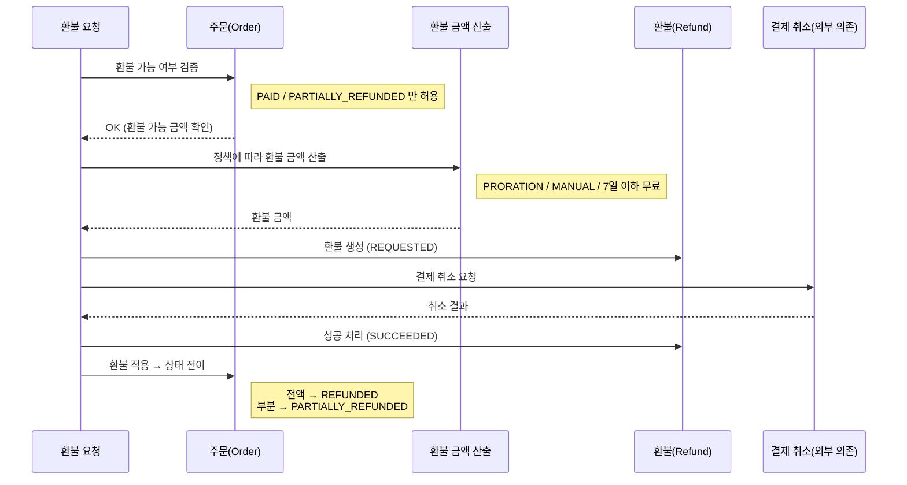
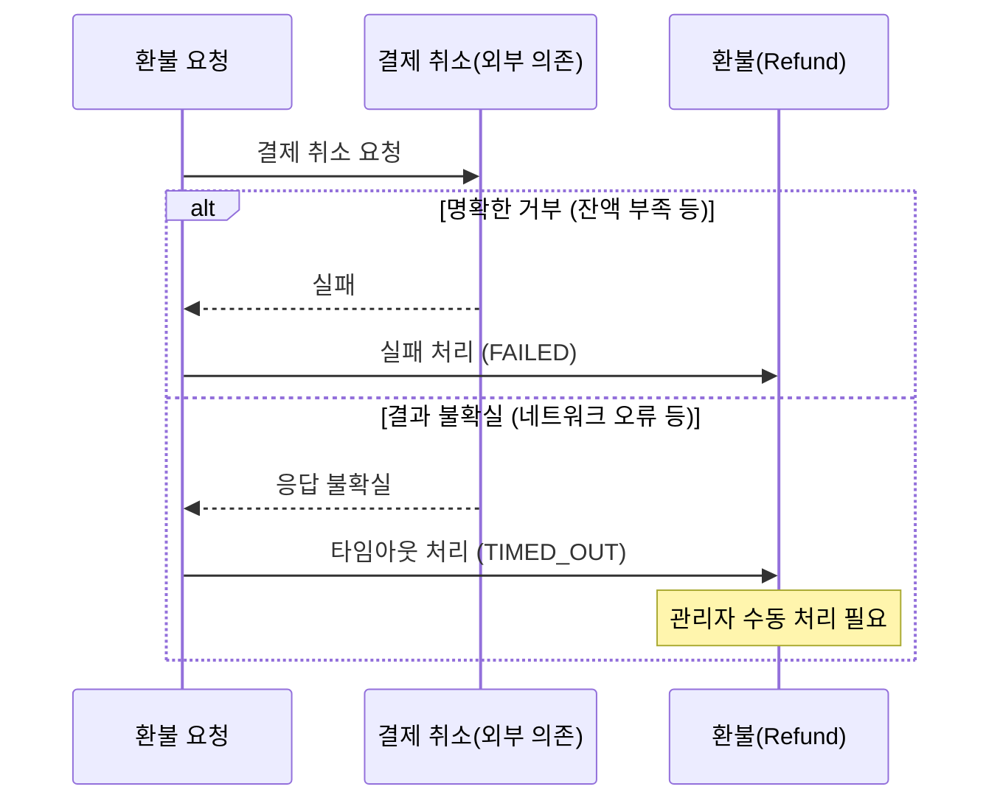

# 환불 정책 도메인 설계

> 실업무 기반: DoDo Class 구독 결제 서비스의 환불 로직을 Java 도메인으로 재설계한다.
> 이 문서는 코드 작성 전 설계 기준이며, A-3 단위테스트와 A-4 Gherkin의 근거가 된다.

---

## 1. 도메인 개념

### 핵심 개념

| 개념 | 설명 |
|------|------|
| Order (주문) | 결제가 완료된 구독 주문. 환불의 대상이 된다. |
| Refund (환불) | 주문에 대한 환불 요청 및 그 결과. |
| RefundPolicy (환불 정책) | 환불 금액을 어떻게 산출할지 결정하는 규칙. |
| CancellableAmount (환불 가능 금액) | `주문금액 - 이미 환불된 금액`. 이 금액을 초과해서 환불할 수 없다. |

### 이번 scope

- 환불 금액 산출 (일할 계산, 수동 지정, 7일 이하 무료)
- 환불 후 주문 상태 전이
- 환불 엔티티 상태 전이
- 결제 취소(외부 의존), DB, 구독 취소는 scope 밖 (→ Mock 대상)

---

## 2. 도메인 흐름 (순서 다이어그램)

> 인프라(Client / API 서버 / PG 세부)가 아니라 **도메인 개념 간의 상호작용**만 표현한다.
> 외부 결제 취소는 하나의 "외부 의존"으로만 추상화한다.

### 2-1. 환불 처리 흐름 (Happy Path)



### 2-2. 결제 취소 결과에 따른 분기



> **task1 단위테스트 범위**: 결제 취소(외부 의존)를 제외한 부분 —
> 주문 환불 가능 검증 · 환불 금액 산출 · 환불/주문 상태 전이. (외부 없이 실행 가능)

---

## 3. 상태 다이어그램

### 3-1. 주문(Order) 상태

```
[PAID] ──────────────────────────────▶ [REFUNDED]
  │          (환불금액 == 전체금액)
  │
  └──────────────────────────────────▶ [PARTIALLY_REFUNDED]
               (환불금액 < 전체금액)
                    │
                    └────────────────▶ [REFUNDED]
                         (추가 환불로 전액 도달)
```

- 환불 가능한 초기 상태: `PAID`, `PARTIALLY_REFUNDED`
- `REFUNDED` 상태에서는 추가 환불 불가
- `PENDING`, `FAILED` 상태에서는 환불 불가

### 3-2. 환불(Refund) 상태

```
              [REQUESTED]
             /     |     \
            /      |      \
     [SUCCEEDED] [FAILED] [TIMED_OUT]
```

- `REQUESTED`: 환불 요청이 생성된 상태. 결제 취소 전.
- `SUCCEEDED`: 결제 취소 성공.
- `FAILED`: 결제 취소가 명확히 거부됨 (잔액 부족 등).
- `TIMED_OUT`: 네트워크 오류 등 결과 불확실. 관리자 수동 처리 필요.

---

## 4. 환불 정책 (RefundPolicy)

### 4-1. PRORATION (일할 계산)

구독 기간 중 사용하지 않은 일수에 비례하여 환불한다.

```
일할 단가  = 결제금액 / 총 구독 일수
환불금액   = 일할 단가 × 잔여 일수

단, 잔여 일수 == 총 일수 (당일 환불) → 전액 환불
단, 잔여 일수 == 0 → 환불금액 0원
```

**예시**

| 결제금액 | 총 일수 | 잔여 일수 | 일할 단가 | 환불금액 |
|---------|--------|---------|---------|--------|
| 30,000원 | 30일 | 15일 | 1,000원 | 15,000원 |
| 30,000원 | 30일 | 30일 | 1,000원 | 30,000원 (전액) |
| 30,000원 | 30일 | 0일  | 1,000원 | 0원 |
| 10,000원 | 30일 | 7일  | 333원   | 2,331원 (절사) |

> 소수점 이하는 절사(floor). 단가 = price / totalDays (정수 나눗셈).

### 4-2. MANUAL (수동 지정)

관리자가 환불 금액을 직접 지정한다. **모든 규칙보다 우선한다** — MANUAL이 지정되면 7일 무료·일할 계산과 무관하게 지정 금액을 따른다.

```
환불금액 = 지정금액
단, 지정금액 > 환불 가능 금액 → 오류
단, 지정금액 <= 0 → 오류
```

### 4-3. 7일 이하 무료 (청약 철회)

결제일로부터 경과일이 7일 이하이면 전액 환불한다 (위약금 없음). 단, MANUAL 지정이 없을 때만 적용된다.

```
경과일 <= 7  → 전액 환불 (무료)
경과일 >= 8  → PRORATION 적용
```

- 전자상거래법상 청약철회 기간에 대응한다.
- PRORATION보다 우선하지만, **MANUAL보다는 후순위**다.
- 경과일 기준: 결제 시각의 날짜 기준 (UTC, 시/분/초 제거).

### 4-4. 정책 우선순위

환불 금액 산출 시 아래 순서로 판정한다.

```
1. MANUAL 지정이 있으면      → 지정 금액 (최우선)
2. 경과일 <= 7 이면          → 전액 환불 (무료)
3. 그 외                     → PRORATION 일할 계산
```

---

## 5. 환불 유형 결정

환불 금액이 확정된 후 환불 유형을 결정한다.

```
환불금액 == 환불 가능 금액 → FULL
환불금액 <  환불 가능 금액 → PARTIAL
```

---

## 6. 경계값 및 예외 케이스

### 6-1. 일할 계산 경계값

| 케이스 | 입력 | 기대 결과 |
|--------|------|----------|
| 당일 환불 | remainingDays == totalDays | 전액 환불 |
| 마지막 날 환불 | remainingDays == 1 | 일할 단가 × 1 |
| 만료 후 환불 | remainingDays == 0 | 환불금액 0 |
| 소수점 절사 | 10,000원 / 30일 × 7일 | 2,331원 |
| totalDays <= 0 | 잘못된 구독 기간 | 예외 발생 |

### 6-2. 7일 이하 무료 경계값

| 케이스 | 조건 | 기대 결과 |
|--------|------|----------|
| 당일 환불 | 경과일 0일 | 전액 환불 |
| 무료 경계 | 경과일 7일 | 전액 환불 |
| 무료 종료 직후 | 경과일 8일 | 선택 정책 적용 |

### 6-3. 환불 가능 여부 경계값

| 케이스 | 조건 | 기대 결과 |
|--------|------|----------|
| 정상 환불 | 주문 PAID, 환불금액 <= cancellableAmount | 성공 |
| 이미 전액 환불 | 주문 REFUNDED | 환불 불가 예외 |
| 결제 안 된 주문 | 주문 PENDING / FAILED | 환불 불가 예외 |
| 환불금액 초과 | 환불금액 > cancellableAmount | 예외 발생 |
| 수동 금액 0 이하 | manualAmount <= 0 | 예외 발생 |
| 부분 환불 후 전액 도달 | canceledAmount + refundAmount == amount | REFUNDED 전이 |
| 부분 환불 후 미도달 | canceledAmount + refundAmount < amount | PARTIALLY_REFUNDED 유지 |

### 6-4. 주문 상태 전이 경계값

| 환불 전 주문 상태 | 환불 후 상태 | 조건 |
|-----------------|-------------|------|
| PAID | REFUNDED | 전액 환불 |
| PAID | PARTIALLY_REFUNDED | 부분 환불 |
| PARTIALLY_REFUNDED | REFUNDED | 추가 환불로 전액 도달 |
| PARTIALLY_REFUNDED | PARTIALLY_REFUNDED | 추가 환불, 아직 잔액 있음 |

---

## 7. 동시성 처리

> task1(순수 도메인) scope 밖이지만, 실서비스 정합성을 위해 설계 기준으로 남긴다.

결제 취소 API 호출 때문에 트랜잭션이 둘로 나뉜다. 이 사이 구간에 같은 주문에 대한 다른 환불 요청이 끼어들면 이중 환불·상태 꼬임이 생긴다.

```
TX1: 환불 생성(REQUESTED)  →  [외부 결제취소 API]  →  TX2: 환불 상태 변경(SUCCEEDED/FAILED/TIMED_OUT)
                              └ TX 밖, 이 구간이 위험 ┘
```

### 7-1. 주문 락 — 환불 요청 시점 (TX1)

- TX1에서 대상 Order를 락으로 잡는다 (비관적 락).
- 동시에 들어온 두 요청이 같은 주문에 REQUESTED를 두 번 만드는 것을 막는다.
- "진행 중 환불(REQUESTED/TIMED_OUT)이 있으면 차단" 검증과 함께 동작한다.

### 7-2. 상태 변경 낙관적 락 — 환불 완료 시점 (TX2)

- TX2에서 환불 상태를 바꿀 때, 현재 상태가 **여전히 REQUESTED인지** 낙관적 락(version)으로 확인한다.
- 이미 다른 처리(예: 관리자 수동 처리, TIMED_OUT 재처리)가 상태를 바꿨다면 충돌로 실패시켜 이중 반영을 막는다.

---

## 8. 의사결정 기록

### 결정 사항

- 소수점 절사 기준: **floor(절사)** — 실서비스 기준.
- 잔여일/경과일 계산 기준: 결제·환불 요청 시각의 **UTC 날짜**로 계산 (시/분/초 제거).
- MANUAL 정책 0원 환불: **불허** (0 이하 예외).
- 부분 환불 후 환불 가능 금액: `amount - canceledAmount`로 재계산.
- 정책 우선순위: **MANUAL > 7일 이하 무료 > PRORATION**.
- 동시성: 환불 요청 시 **Order 비관적 락**, 상태 변경 시 **REQUESTED 낙관적 락**.

### 미결 사항

- 현재 없음.
