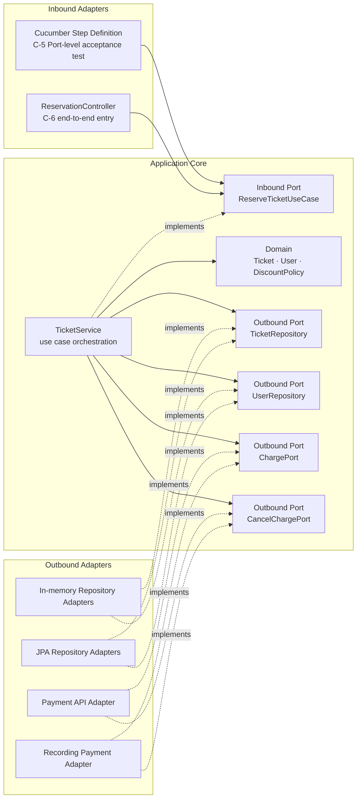

# Task C-3: 헥사고날 설계 + 죽은 코드 재설계

(Grit's Why): 이론은 본인 코드로 세워야 손에 붙습니다. 1-2에서 SOLID로 재설계한 그 도메인(예: 티켓 예매)을 이번엔 포트와 어댑터로 올립니다.

### 수행 내용

1. 1-2의 My Design(또는 B-2 kata 재설계 결과)을 헥사고날 구조로 그리세요. Core(도메인) / Inbound Port / Outbound Port / Adapter를 식별하고, 의존성이 모두 안쪽을 향하는지 확인하세요.
2. 핵심 유스케이스 하나를 Gherkin 시나리오(Given/When/Then)로 쓰세요. When 절이 Inbound Port와 1:1로 매칭되는지 확인하세요. (이 Feature는 C-5에서 실제로 실행됩니다.)
3. 헥사고날 다이어그램 + 'Why' 설명을 쓰세요. (예: 결제 Adapter를 외부 PG로 교체해도 Core는 무수정인 이유, Mock으로 Core만 빠르게 단위 테스트할 수 있는 이유.)

### 제출물

- [x]  헥사고날 다이어그램(Core/Port/Adapter 식별) + When-Inbound Port 매핑.
- [x]  핵심 유스케이스 Gherkin Feature 1개.
- [x]  'Why 헥사고날' 설명(어댑터 교체 무수정 + 테스트 용이성). (최소 500자)

---

## 먼저 내린 판단: B-4와 B-5는 이미 헥사고날 아닌가

결론부터 말하면 **이미 헥사고날의 핵심 방향은 들어가 있지만, C-3의 완료 상태는 아니다.** B-4 설계와 B-5 코드에서 `TicketService`는 구체 DB나 결제 API 대신 `TicketRepository`, `UserRepository`, `ChargePort`에 의존한다. 테스트의 `InMemoryTicketRepository`, `InMemoryUserRepository`, `RecordingPaymentApi`는 이 포트를 구현한다. 외부 세부 구현이 Core가 소유한 추상에 의존한다는 DIP는 이미 적용되어 있다. JDK 17로 B-5 테스트를 다시 실행한 결과도 8개 시나리오와 53개 Step이 모두 통과했다.

그러나 현재 Cucumber Step Definition은 `TicketService` 구체 클래스를 직접 생성하고 호출한다. `TicketService.reserveTicket`을 사실상의 입력 경계로 볼 수는 있지만, 유스케이스 경계를 나타내는 별도 Inbound Port 계약은 아직 없다. 모든 프로덕션 클래스가 `com.thinking.ticket` 한 패키지에 있어 Core와 Adapter의 경계도 구조로 드러나지 않는다. 테스트용 Outbound Adapter는 있지만 JPA와 외부 결제 시스템에 연결되는 프로덕션 Adapter도 아직 없다. 따라서 C-3에서 할 일은 헥사고날을 처음부터 다시 만드는 것이 아니라, **B-4와 B-5에서 만든 Outbound 경계를 유지하면서 Inbound 경계를 명시하고 각 역할과 의존 방향을 검증 가능한 형태로 고정하는 것**이다.

| 구분 | B-4와 B-5의 현재 상태 | C-3의 목표 상태 |
| --- | --- | --- |
| Domain | `Ticket`, `User`, `DiscountPolicy`가 기술 타입 없이 존재한다. | 현재 구조를 유지하고 Core 안에 둔다. |
| Inbound Port | `TicketService.reserveTicket`이 사실상의 입력 경계다. 별도 계약은 없고 Step Definition이 구체 서비스에 의존한다. | `ReserveTicketUseCase`와 `ReserveTicketCommand`로 계약을 명시한다. |
| Outbound Port | `TicketRepository`, `UserRepository`, `ChargePort`가 있다. | 현재 포트를 유지하고 저장 실패 보상을 위한 계약을 보완한다. |
| Inbound Adapter | Cucumber Step Definition이 사실상 테스트 Driver 역할을 하지만 구체 서비스에 결합돼 있다. | C-5에서는 Inbound Port를 호출하고, C-6에서는 HTTP Controller도 같은 Port를 호출한다. |
| Outbound Adapter | 테스트용 In-memory Fake와 결제 Test Double만 있다. | C-5에서 JPA Adapter와 외부 결제 Adapter를 추가하고 Fake와 교체 검증한다. |
| 경계 강제 | 한 패키지에 평평하게 놓여 있다. | 패키지 분리와 의존성 테스트로 바깥에서 안쪽으로만 의존하게 한다. |

## 목표 헥사고날 설계

여기서 Core는 업무 규칙을 가진 Domain과 유스케이스를 조정하는 Application을 합친 영역이다. Adapter는 Core가 정한 Port를 통해서만 들어오거나 나간다.

Inbound Port를 표현하는 방법은 세 가지를 비교했다.

| 접근 | 장점 | 비용과 한계 |
| --- | --- | --- |
| `ReserveTicketUseCase` 인터페이스로 명시 | Cucumber와 HTTP라는 두 Inbound Adapter가 같은 계약에 의존한다. When과 Port를 1:1로 제시하기 쉽다. | 인터페이스와 Command 타입이 추가된다. |
| `TicketService.reserveTicket` 공개 메서드를 Port로 간주 | 현재 코드 변경이 가장 작고 Inbound Adapter가 하나일 때는 충분할 수 있다. | Adapter가 구체 서비스에 결합되고 과제에서 요구한 Port 식별이 덜 선명하다. |
| Inbound API를 별도 모듈로 분리 | 컴파일 단계에서 경계를 가장 강하게 막는다. | 현재 walking skeleton 규모에는 모듈과 빌드 설정 비용이 크다. |

이번에는 첫 번째 방식을 선택한다. C-5의 Cucumber Adapter와 C-6의 HTTP Adapter라는 두 Driver가 이미 예정되어 있고, 과제의 검증 기준도 When과 Inbound Port의 직접 대응이기 때문이다. 인터페이스가 헥사고날의 필수 문법이라서 선택한 것은 아니다.



이 그림의 화살표는 런타임 호출 순서가 아니라 소스 코드의 의존 방향이다. Inbound Adapter는 Core의 Inbound Port를 알고, Outbound Adapter는 Core의 Outbound Port를 구현한다. Core는 어느 Adapter 클래스도 import하지 않는다. 런타임 호출은 다음 순서로 진행된다.

```text
Cucumber Step Definition 또는 ReservationController
    -> ReserveTicketUseCase.reserve(command)
    -> TicketService
    -> UserRepository와 TicketRepository
    -> Ticket.ensureReservable()
    -> DiscountPolicy.finalAmount()
    -> ChargePort
    -> Ticket.assignTo(userId)
    -> TicketRepository.save(ticket)
```

패키지는 역할이 보이도록 다음처럼 나눈다. 이름만 나누고 의존 방향이 새는 일을 막기 위해 C-6의 AI 검수 단계에서는 Core가 `adapter` 패키지를 참조하지 않는지 자동 검사한다.

```text
com.thinking.ticket
├─ domain
│  ├─ Ticket
│  ├─ User
│  └─ DiscountPolicy
├─ application
│  ├─ port.in
│  │  ├─ ReserveTicketUseCase
│  │  └─ ReserveTicketCommand
│  ├─ port.out
│  │  ├─ TicketRepository
│  │  ├─ UserRepository
│  │  ├─ ChargePort
│  │  └─ CancelChargePort
│  └─ service
│     └─ TicketService
└─ adapter
   ├─ in.web
   │  └─ ReservationController
   ├─ in.cucumber
   │  └─ TicketReservationSteps
   ├─ out.persistence
   │  ├─ TicketJpaAdapter
   │  └─ UserJpaAdapter
   └─ out.payment
      └─ PaymentApiAdapter
```

## When과 Inbound Port의 1:1 매핑

Gherkin의 모든 `When 회원이 티켓 예매를 요청한다`는 하나의 업무 행위를 뜻한다. Step Definition은 값을 `ReserveTicketCommand`로 변환한 뒤 아래 Inbound Port 메서드 하나만 호출한다.

```java
public interface ReserveTicketUseCase {
    ReservationResult reserve(ReserveTicketCommand command);
}
```

```text
When 회원 1이 카드정보 "card-token"으로 티켓 20의 예매를 요청한다
    -> TicketReservationSteps.reserveTicket(...)
    -> ReserveTicketCommand(userId=1, ticketId=20, paymentInfo="card-token")
    -> ReserveTicketUseCase.reserve(command)
```

기존 Step Definition처럼 `new TicketService(...)`를 When 안에서 직접 호출하지 않는다. 테스트 조립 지점에서 `ReserveTicketUseCase` 구현을 주입한다. 이렇게 해야 Cucumber가 서비스 구현이 아니라 공개된 유스케이스 계약을 검증하고, C-6의 HTTP Controller도 같은 계약을 재사용할 수 있다.

## 핵심 유스케이스 Gherkin Feature

Feature는 티켓 예매 하나다. Happy Path와 C-5에서 요구하는 주요 Unhappy Path를 같은 Inbound Port 계약에 고정한다.

```gherkin
Feature: 티켓 예매
  회원은 예약 가능한 티켓의 결제에 성공하면 티켓을 예매할 수 있다.
  예매 조건을 충족하지 못하거나 외부 처리가 실패하면 일관되지 않은 상태를 남기지 않는다.

  Background:
    Given 회원 저장소와 티켓 저장소가 비어 있다

  Scenario: 등록된 회원이 예약 가능한 티켓을 예매한다
    Given 회원 1이 등록되어 있다
    And 가격 30000원짜리 미예약 티켓 20이 있다
    When 회원 1이 카드정보 "card-token"으로 티켓 20의 예매를 요청한다
    Then 예매는 성공한다
    And 티켓 20은 회원 1에게 예약된다
    And 30000원이 청구된다

  Scenario: 등록되지 않은 회원은 티켓을 예매할 수 없다
    Given 가격 30000원짜리 미예약 티켓 20이 있다
    When 회원 1이 카드정보 "card-token"으로 티켓 20의 예매를 요청한다
    Then 예매는 회원 없음으로 거부된다
    And 결제는 청구되지 않는다

  Scenario: 판매 중지된 티켓은 예매할 수 없다
    Given 회원 1이 등록되어 있다
    And 가격 30000원짜리 판매 중지된 티켓 20이 있다
    When 회원 1이 카드정보 "card-token"으로 티켓 20의 예매를 요청한다
    Then 예매는 판매 중지로 거부된다
    And 결제는 청구되지 않는다

  Scenario: 결제가 거절되면 티켓은 예약되지 않는다
    Given 회원 1이 등록되어 있다
    And 가격 30000원짜리 미예약 티켓 20이 있다
    And 결제는 거절되는 상황이다
    When 회원 1이 카드정보 "card-token"으로 티켓 20의 예매를 요청한다
    Then 예매는 결제 실패로 거부된다
    And 티켓 20은 예약되지 않는다

  Scenario: 결제 후 티켓 저장이 실패하면 결제를 취소한다
    Given 회원 1이 등록되어 있다
    And 가격 30000원짜리 미예약 티켓 20이 있다
    And 결제는 성공하지만 티켓 저장은 실패하는 상황이다
    When 회원 1이 카드정보 "card-token"으로 티켓 20의 예매를 요청한다
    Then 예매는 저장 실패로 거부된다
    And 성공한 결제는 취소된다
    And 티켓 20은 예약되지 않는다
```

마지막 시나리오는 B-5에서 특성화한 기존 결함을 그대로 근거로 삼았다. 현재 구현은 결제 후 저장이 실패하면 결제가 청구된 채 남고 취소 호출도 없다. 헥사고날 구조만 만든다고 이 일관성 문제가 자동으로 해결되지는 않는다.

| 처리 대안 | 장점 | 비용과 남는 위험 |
| --- | --- | --- |
| 결제 성공 후 저장 실패 시 즉시 취소 | 현재 순서를 유지하며 가장 작은 변경으로 불일치를 줄인다. | 취소도 실패할 수 있다. 결제 식별자, 멱등성, 실패 기록이 필요하다. |
| 결제 승인, 예약 저장, 결제 확정으로 단계를 분리 | 결제와 예약 상태를 더 명시적으로 조정할 수 있다. | 외부 결제 시스템의 승인과 확정 기능, 추가 상태 모델이 필요하다. |
| 현재 동작을 유지하고 결함만 기록 | 구현 변경이 없다. | 돈만 청구되고 예약은 실패하는 상태를 walking skeleton의 정상 설계로 남긴다. |

C-3의 목표 설계에는 첫 번째 방식을 선택해 `CancelChargePort`와 보상 시나리오를 넣었다. 이것은 구현 완료를 뜻하지 않는다. C-5에서 `ChargePort`가 결제 식별자를 포함한 결과를 반환하도록 바꾸고, Fake와 실제 결제 Adapter가 취소의 멱등성을 지키는지 검증해야 한다. 취소 실패를 운영 수준까지 처리하려면 재시도 가능한 실패 기록이 추가로 필요하다. 그 작업은 이번 다이어그램보다 큰 범위이므로 C-5 구현 시 별도 실패 시나리오로 결정한다.

## Why 헥사고날

헥사고날을 적용하는 이유는 폴더 모양을 육각형처럼 만들기 위해서가 아니라, 업무 정책이 외부 기술의 변경 이유를 떠안지 않게 하기 위해서다. 티켓 예매의 핵심은 회원이 존재하는지 확인하고, 티켓이 예약 가능한지 판단하고, 결제 금액을 결정하고, 성공한 예약 상태를 저장하는 유스케이스다. 이 정책이 `JpaRepository`, Hibernate Proxy, 특정 결제 SDK의 요청 객체를 직접 사용하면 저장 기술이나 결제 벤더를 바꾸는 일이 곧 업무 코드 수정이 된다. 반대로 Core가 자신에게 필요한 기능을 `TicketRepository`, `UserRepository`, `ChargePort` 같은 업무 목적의 Port로 정의하면 JPA와 결제 SDK는 그 계약을 구현하는 Adapter가 된다.

예를 들어 JPA 저장소를 In-memory Fake로 바꾸거나 결제 API를 `RecordingPaymentAdapter`로 바꿀 때, 두 구현이 같은 Port의 입력과 출력 계약을 지킨다면 `Ticket`, `TicketService`, `ReserveTicketUseCase`는 수정하지 않는다. C-5에서는 동일한 Gherkin Feature를 JPA Adapter와 In-memory Adapter 조합에 각각 실행하고 Core diff가 없는지 확인해 이 주장을 증명한다. 다만 기술 변경이 Port의 의미까지 바꾸거나 새로운 업무 규칙을 요구하면 Core도 바뀔 수 있다. 헥사고날은 모든 변경을 없애는 구조가 아니라, **Port 계약 안에서 일어난 기술 교체의 영향이 Adapter 밖으로 번지지 않게 하는 구조**다.

테스트도 같은 경계의 이득을 얻는다. `Ticket`의 예약 불변식은 평범한 Java 객체로 만들 수 있어 Mock 없이 빠르게 단위 테스트한다. `TicketService`의 협력 순서는 실제 DB와 결제 API 대신 In-memory Repository와 통제 가능한 결제 Fake를 Port에 끼워 검증한다. 이때 Mock으로 Core 자체를 흉내 내는 것이 아니라, Core 바깥의 I/O만 Test Double로 대체한다. JPA 매핑, SQL 제약, 외부 API 직렬화처럼 Adapter 내부에서만 발생하는 위험은 Testcontainers와 Adapter 통합 테스트로 따로 검증한다. 마지막으로 Cucumber 인수테스트는 Inbound Port를 호출해 사용자 관점의 결과를 확인한다. 이렇게 순수 업무 규칙, 유스케이스 협력, 기술 접점의 실패를 서로 다른 크기와 비용의 테스트로 나눌 수 있어, 작은 규칙 하나를 확인하려고 매번 Spring Context와 DB 전체를 띄우지 않아도 된다.

## Task C 전체와 연결해 추가로 손볼 곳

1. **C-3 설계 반영, C-5 구현 예정 — C-2의 결정을 적용한다.** 현재 `Ticket`은 JPA Annotation이 없는 순수 Domain 객체다. C-5에서 JPA Adapter와 In-memory Adapter 교체를 증명해야 하므로 이번 과제에서는 `TicketJpaEntity`를 Adapter에 두고 Domain 객체와 분리한다. 이것은 모든 프로젝트에 항상 분리를 적용한다는 뜻이 아니라, 저장 Adapter 교체와 Core 무수정이 이번 과제의 검증 목표이기 때문에 선택한 것이다.
2. **C-5 구현 예정 — Step Definition은 Inbound Port만 호출한다.** 기존 B-5 Step은 `TicketService`를 직접 생성하므로 그대로 복사하지 않는다. Feature 문장은 재사용하되 조립 코드를 Port 기준으로 고친다.
3. **C-5 검증 예정 — Adapter 교체 증빙은 같은 테스트의 재실행으로 남긴다.** JPA Adapter와 Testcontainers DB 조합, In-memory Adapter 조합에 동일 Feature를 실행한다. 두 실행의 GREEN 로그와 Core 디렉터리 diff가 없다는 결과를 함께 제출한다.
4. **C-5 구현과 검증 예정 — In-memory Adapter가 실제 저장 경계를 흉내 내는지 확인한다.** 현재 Fake는 `Ticket` 객체의 같은 참조를 Map에 보관한다. 저장 전에 Domain 객체를 변경한 뒤 `save`가 실패하면 Map 안의 객체도 이미 바뀌어 있을 수 있다. 조회와 저장에서 복사본을 사용하면 현재 mutable Domain을 유지하면서 저장 성공 시점에만 상태를 반영할 수 있다. Domain을 불변 객체로 바꾸고 새 상태를 반환하게 만드는 방법은 공유 참조를 원천 차단하지만 기존 도메인 API 변경이 더 크다. 이번에는 전자를 선택한다. C-5에서 저장 실패 뒤 다시 조회한 티켓이 미예약 상태인지 같은 Feature로 확인하고, Testcontainers DB 결과와 의미가 같은지 비교한다.
5. **C-5와 C-6 검증 예정 — 두 테스트 경계를 구분한다.** C-5는 Inbound Port부터 시작하는 Port-level 인수테스트다. C-6은 실제 HTTP 요청이 `ReservationController`를 거쳐 같은 Inbound Port로 들어오는 end-to-end walking skeleton이다. 둘을 같은 테스트라고 부르면 실제 Inbound Adapter 검증이 빠진다.
6. **C-6 구현 예정 — 경계는 패키지 이름이 아니라 자동 검증으로 고정한다.** Core가 `adapter`나 Spring, JPA 타입에 의존하지 않는지 의존성 테스트나 모듈 컴파일 경계로 확인한다. 이 검사를 C-6의 AI 생성 단계마다 실행하면 AI가 Core에서 JPA Entity를 직접 참조하는 제안을 즉시 기각할 수 있다.
7. **C-4 구현 예정 — 컨테이너가 로컬 Java 설정까지 제거하게 한다.** 기존 B-5는 로컬 `JAVA_HOME`이 Java 8을 가리키면 JDK 17로 컴파일된 테스트가 실행되지 않았다. Dockerfile에서 JDK 버전을 고정하고 Compose와 CI도 같은 이미지를 사용하면 이 환경 차이를 제출물의 재현성 근거로 삼을 수 있다.

현재 검증이 끝난 범위는 B-5 기존 코드의 회귀 테스트다. JDK 17을 지정해 실행한 결과 8개 시나리오와 53개 Step이 모두 통과했다. 새 Inbound Port, 결제 보상, 복사 의미를 고친 In-memory Adapter, JPA Adapter 교체는 C-3에서 목표와 검증 시나리오만 정했으며 아직 구현하거나 GREEN을 확인하지 않았다. 이 항목들은 C-5와 C-6의 완료 증빙으로 남긴다.
