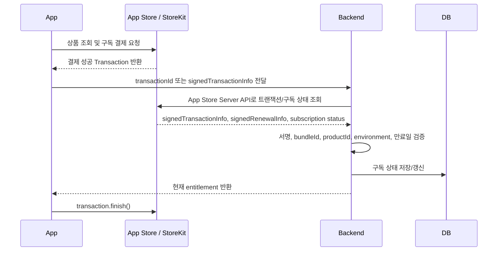

# Apple 인앱 구독 결제 Flow

## 전제

- 결제 상품은 Apple `auto-renewable subscription`만 사용한다.
- 앱은 StoreKit 2 기준으로 결제를 수행한다.
- 유료 기능 권한은 앱의 결제 성공 콜백이 아니라 백엔드 검증 결과로만 부여한다.
- 구독 상품은 가능하면 하나의 `Subscription Group`에 묶는다. Apple은 같은 그룹 안에서 사용자가 동시에 하나의 구독만 보유하도록 관리한다.

## 핵심 식별자

- `userId`: 서비스 사용자 ID
- `productId`: Apple 구독 상품 ID
- `transactionId`: 개별 결제/갱신 트랜잭션 ID
- `originalTransactionId`: 최초 구독 트랜잭션 ID. 같은 구독 생애주기를 묶는 기준
- `expiresDate`: 현재 결제 주기의 만료 시각
- `environment`: `Sandbox` 또는 `Production`

백엔드는 `originalTransactionId`를 기준으로 한 사용자에게 연결된 구독 생애주기를 저장한다.

## 전체 Flow



## 초기 구매

1. 앱이 StoreKit으로 구독 상품을 조회한다.
2. 사용자가 결제를 승인한다.
3. 앱은 StoreKit에서 받은 `transactionId` 또는 `signedTransactionInfo`를 백엔드에 전송한다.
4. 백엔드는 Apple App Store Server API로 트랜잭션과 구독 상태를 조회한다.
5. 백엔드는 다음을 검증한다.
   - Apple 서명 검증 성공
   - `bundleId`가 우리 앱과 일치
   - `productId`가 판매 중인 구독 상품과 일치
   - `environment`가 현재 서버 환경과 일치
   - `expiresDate`가 현재 시각 이후
   - 환불/취소로 인한 `revocationDate`가 없음
6. 검증 성공 시 `ACTIVE`로 저장하고 앱에 유료 권한을 반환한다.
7. 앱은 서버 응답 성공 이후 StoreKit 트랜잭션을 `finish()` 처리한다.

## 갱신 주기별 처리

Apple 구독 기간은 App Store Connect에서 1주, 1개월, 2개월, 3개월, 6개월, 1년 중 선택한다. 어떤 주기든 백엔드 로직은 동일하게 `expiresDate`와 최신 구독 상태를 기준으로 권한을 계산한다.

| 상황 | Apple 이벤트/상태 | 백엔드 처리 | 서비스 권한 |
| --- | --- | --- | --- |
| 최초 결제 성공 | 초기 Transaction | `ACTIVE`, `expiresDate` 저장 | 부여 |
| 자동 갱신 성공 | `DID_RENEW` | 최신 `transactionId`, `expiresDate`로 갱신 | 유지 |
| 사용자가 갱신 취소 | `DID_CHANGE_RENEWAL_STATUS` 또는 renewal info의 자동 갱신 꺼짐 | `CANCELED_WILL_EXPIRE`로 표시, 만료일까지 유지 | 만료일까지 유지 |
| 취소 후 만료 도달 | `EXPIRED` | `EXPIRED` 저장 | 회수 |
| 결제 실패 | `DID_FAIL_TO_RENEW` | Grace Period 여부 확인 | 조건부 유지 |
| Grace Period 중 | renewal info에 grace period 만료일 존재 | `GRACE_PERIOD` 저장 | 유지 |
| Grace Period 종료 후 미복구 | `GRACE_PERIOD_EXPIRED` 또는 만료 상태 | `BILLING_RETRY` 또는 `EXPIRED` | 보통 회수 |
| 결제 복구 | `DID_RECOVER` | `ACTIVE`, 새 `expiresDate` 저장 | 부여/유지 |
| 환불/철회 | `REFUND`, `REVOKE`, `revocationDate` | `REVOKED` 저장 | 즉시 회수 |
| 업그레이드 | `DID_CHANGE_RENEWAL_PREF`, 새 Transaction | 새 `productId`/권한으로 즉시 또는 Apple 상태 기준 반영 | 새 등급 반영 |
| 다운그레이드/크로스그레이드 | 갱신 정보 변경 | 다음 갱신 시 적용될 상품을 저장 | 현재 기간은 기존 권한 유지 |

## 서버 알림 처리

App Store Server Notifications V2를 백엔드 Webhook으로 받는다.

1. Apple이 `signedPayload`를 서버로 보낸다.
2. 백엔드는 서명을 검증하고 `notificationType`, `subtype`, `transactionInfo`, `renewalInfo`를 파싱한다.
3. `originalTransactionId` 기준으로 구독 레코드를 찾는다.
4. 알림 내용만 맹신하지 말고, 필요하면 App Store Server API로 최신 상태를 다시 조회한다.
5. 같은 알림이 여러 번 와도 안전하도록 `notificationUUID` 또는 최신 `transactionId` 기준으로 멱등 처리한다.

## 권한 계산 규칙

앱이나 API가 유료 기능 접근을 요청할 때마다 백엔드는 저장된 구독 상태로 entitlement를 계산한다.

```text
ACTIVE:
  now < expiresDate && revocationDate 없음

GRACE_PERIOD:
  now < gracePeriodExpiresDate

CANCELED_WILL_EXPIRE:
  now < expiresDate

BILLING_RETRY:
  grace period가 없거나 지났고 결제가 아직 복구되지 않음

EXPIRED:
  now >= expiresDate && 유효한 갱신 없음

REVOKED:
  revocationDate 존재
```

권한 부여 상태는 `ACTIVE`, `GRACE_PERIOD`, `CANCELED_WILL_EXPIRE`만 허용한다. 단, `CANCELED_WILL_EXPIRE`는 이름만 취소 상태일 뿐 결제 기간이 남아 있으므로 만료일까지 유료 기능을 제공한다.

## 주기별 주의사항

- 1주 구독: Grace Period를 16일 또는 28일로 설정해도 실제 유예 기간은 최대 6일로 제한된다.
- 월/연 구독: Grace Period는 3일, 16일, 28일 중 설정 가능하다.
- 구독 주기가 달라도 백엔드는 `expiresDate` 기준으로만 판단하면 된다.
- Sandbox는 갱신 시간이 실제보다 짧으므로 운영 만료 계산 로직과 테스트 시간표를 분리해서 문서화한다.

## 복구/재설치 Flow

1. 사용자가 앱 재설치 또는 새 기기에서 로그인한다.
2. 앱은 StoreKit의 현재 entitlement 또는 구매 복원 결과를 백엔드에 전달한다.
3. 백엔드는 `originalTransactionId` 기준으로 Apple 최신 구독 상태를 조회한다.
4. 이미 다른 `userId`에 연결된 `originalTransactionId`라면 계정 연결 정책에 따라 차단하거나 이전 절차를 요구한다.
5. 검증 성공 시 현재 사용자에게 구독 권한을 다시 연결한다.

## 정기 동기화

Webhook이 누락될 수 있으므로 백엔드는 별도 배치로 활성 구독을 주기적으로 재검증한다.

- 대상: `ACTIVE`, `GRACE_PERIOD`, `BILLING_RETRY`, `CANCELED_WILL_EXPIRE`
- 기준: `expiresDate`가 가까운 구독 또는 최근 알림 처리 실패 구독
- 작업: App Store Server API로 최신 상태 조회 후 DB 보정

## 최소 DB 필드

```text
subscriptions
- id
- user_id
- platform = apple
- original_transaction_id
- latest_transaction_id
- product_id
- status
- environment
- purchased_at
- expires_at
- grace_period_expires_at
- auto_renew_status
- revocation_date
- last_notification_uuid
- raw_transaction_jws
- raw_renewal_jws
- created_at
- updated_at
```

## 구현 순서

1. App Store Connect에 Subscription Group과 구독 상품을 만든다.
2. 백엔드에 Apple App Store Server API 인증 키를 설정한다.
3. 백엔드에 결제 검증 API를 만든다.
4. 앱에서 StoreKit 결제 후 검증 API를 호출한다.
5. 백엔드에 App Store Server Notifications V2 Webhook을 만든다.
6. 권한 체크 API를 모든 유료 기능 앞에 연결한다.
7. Sandbox에서 최초 결제, 갱신, 취소, 결제 실패, Grace Period, 환불, 복원을 테스트한다.

## 참고 문서

- Apple App Store Server API: https://developer.apple.com/documentation/appstoreserverapi
- Apple App Store Server Notifications: https://developer.apple.com/documentation/appstoreservernotifications
- Apple StoreKit Transaction: https://developer.apple.com/documentation/storekit/transaction
- Apple auto-renewable subscriptions: https://developer.apple.com/help/app-store-connect/manage-subscriptions/offer-auto-renewable-subscriptions
- Apple Billing Grace Period: https://developer.apple.com/help/app-store-connect/manage-subscriptions/enable-billing-grace-period-for-auto-renewable-subscriptions
